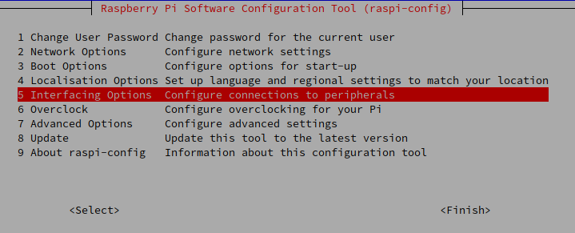
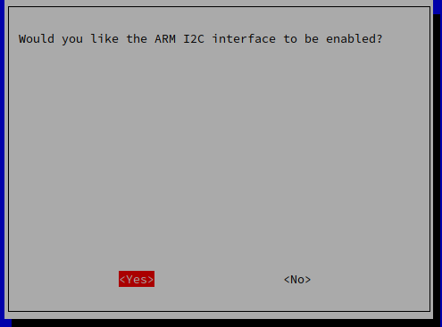

# MPU Interfacing with Raspberry Pi
Simple code to interface with MPU using Raspberry Pi.

## Requirements
No dependencies, just `Python3`.

## Getting Started
this is the first time to interface with raspberry pi so we need to config the raspberry pi for MPU:
 
### Step 1: Enable I2C Communication
First we gonna open a terminal and type : <br >
```sudo raspi-config``` <br >
this gonna appear


then we need to enable I2C from last page we gonna choose <br > 
```Interfacing Options```


we gonna choose P5 I2C and choose ```YES``` in this one:


### Step2: install pip and GPIO lib
```sudo apt install build-essential python-dev python-pip``` <br >
after this we need to install raspberry pi GPIO lib. <br >
```pip install RPi.GPIO```

### Step 3: install SMBus lib:
we need to install SMBus lib in raspberry pi so we gonna use this command: <br >
 ```sudo apt install python3-smbus```

### Step 4: install the MPU lib:
```pip install mpu6050```

## Creadits/Inspirations
- [MPU6050 Gyro Sensor Interfacing with Raspberry Pi](https://circuitdigest.com/microcontroller-projects/mpu6050-gyro-sensor-interfacing-with-raspberry-pi)
- [MPU6050 (Accelerometer+Gyroscope) Interfacing with Raspberry Pi](https://www.electronicwings.com/raspberry-pi/mpu6050-accelerometergyroscope-interfacing-with-raspberry-pi)

## License
This project is licensed under the MIT License.
